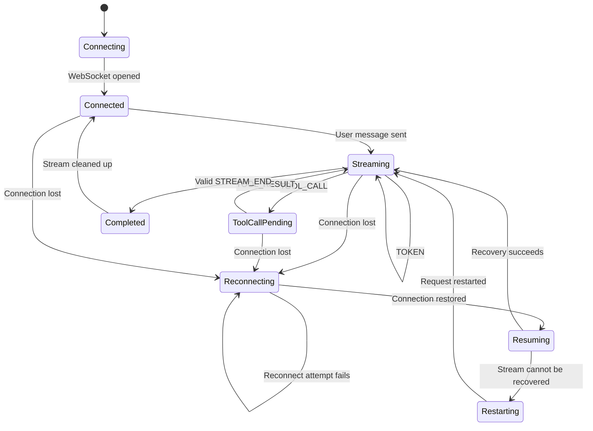
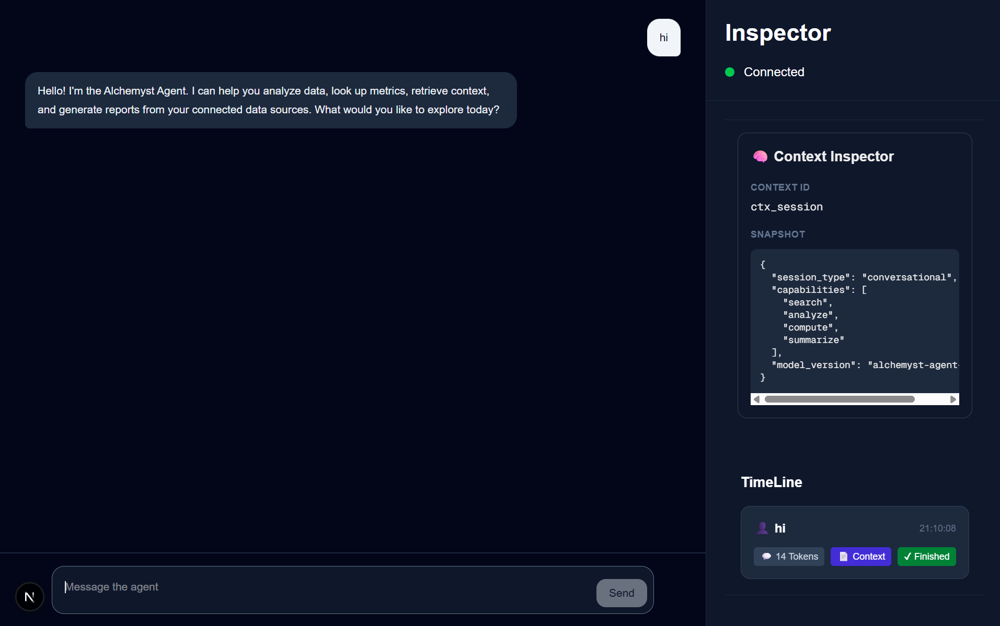
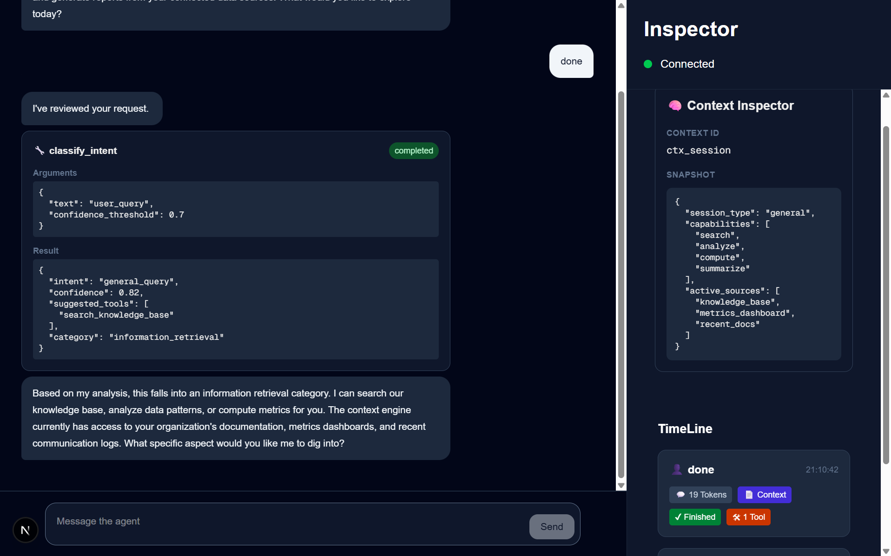

# Real-Time Agent Client

A real-time agent client built with Next.js, TypeScript, Zustand, and WebSockets. The application separates WebSocket transport, sequence-based ordering and deduplication, protocol event processing, and UI state management to provide incremental streaming while handling tool calls, context updates, out-of-order messages, duplicates, and connection failures.

The client uses a `SequenceBuffer` to order incoming messages by `seq`, an `EventProcessor` to convert protocol messages into application-level events, and Zustand to maintain chat messages, tool state, context, and the trace timeline.

## WebSocket State Machine



## Run Locally

### 1. Clone the repository

```bash
git clone https://github.com/YuvaBalaji01/agent-server.git
cd agent-server
```

### 2. Install dependencies

```bash
npm install
```

### 3. Start the Agent Server

Run the provided assignment agent-server locally. The client expects the WebSocket agent server to be available at:

```text
ws://localhost:4747/ws
```
Link for the container : https://github.com/Alchemyst-ai/hiring/tree/main/June-2026_FullStackAI%2Fagent-server
```bash
download the folder agent-server 
cd agent-server 
docker compose up --build
```

Make sure the agent-server is running before starting the client.

### 4. Build the Next.js application

```bash
npm run build
```

### 5. Start the production application

```bash
npm run start
```

Open:

```text
http://localhost:3000
```

For development mode, use:

```bash
npm run dev
```

## Screenshots





## Chaos Mode Recording

The following recording demonstrates the application running under chaos-mode conditions, including connection interruptions and recovery behavior.

[Watch the Chaos Mode Recording](https://drive.google.com/file/d/1feNQzdvuIPMgOYk5INaabYFCDcIKRQf4/view?usp=sharing)
