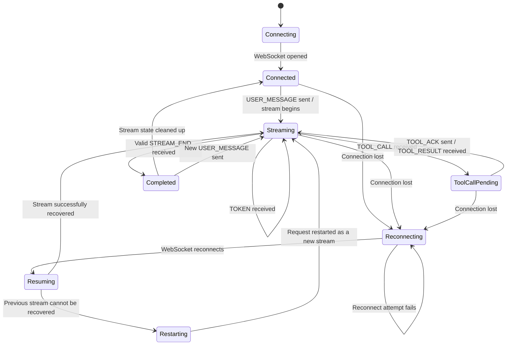

# Real-Time Agent Client

A real-time agent client built with Next.js and TypeScript that communicates with an agent server over WebSockets and incrementally renders streamed responses, tool calls, tool results, and context updates. The application separates WebSocket transport, sequence-based message ordering, protocol event processing, and UI state management to provide deterministic rendering while handling out-of-order events, duplicate messages, tool interruptions, and connection failures.

The client uses a sequence buffer to reorder incoming protocol messages before processing, an event processor to translate protocol messages into application-level events, and Zustand to maintain stable UI state. Connection recovery logic handles interrupted streams and prevents stale events from previous streams from corrupting the currently active response.

---

## Architecture

The application is divided into four main layers:

```text
Agent Server
     │
     │ WebSocket protocol messages
     ▼
WebSocketManager
     │
     │ Raw ServerMessage
     ▼
SequenceBuffer
     │
     │ Ordered / deduplicated messages
     ▼
useAgentClient
     │
     │ Stream validation and connection lifecycle
     ▼
EventProcessor
     │
     │ Application events
     ▼
Zustand Agent Store
     │
     ▼
React / Next.js UI
```

### Responsibilities

**WebSocketManager**
- Opens and closes the WebSocket connection.
- Sends user messages.
- Sends PONG responses.
- Sends TOOL_ACK messages.
- Sends RESUME messages when recovery is required.
- Notifies the application about connection state changes.

**SequenceBuffer**
- Orders server messages using their `seq` values.
- Buffers out-of-order messages until missing predecessors arrive.
- Prevents duplicate messages from being rendered twice.
- Tracks the latest processed/recoverable content sequence.

**useAgentClient**
- Coordinates WebSocket messages and application state.
- Tracks the currently active stream.
- Rejects stale stream-specific messages before they can corrupt sequence state.
- Manages response timeouts.
- Coordinates reconnection and interrupted-stream recovery.

**EventProcessor**
- Converts protocol-level messages into application events.
- Handles tokens, tool calls, tool results, context snapshots, stream completion, and protocol control messages.

**Zustand Store**
- Stores chat messages and immutable message segments.
- Tracks tool-call state.
- Stores context snapshots.
- Maintains the conversation trace timeline.
- Updates the UI incrementally as events arrive.

---

## WebSocket State Machine



The active stream is identified using `stream_id`. Stream-specific events belonging to stale or unexpected streams are rejected before entering the ordering buffer so that an old event cannot advance the sequence state of the active response.

---

# Running the Application

## Prerequisites

- Node.js
- npm
- The provided agent-server

---

## Install Dependencies

From the project root:

```bash
npm install
```

---

## Start the Agent Server

Start the provided agent-server according to the instructions included with the assignment.

The agent server must be running before testing WebSocket communication.

If the agent-server is distributed as a Docker image/container, start the provided server container before launching the Next.js application.

> Update this section with the exact agent-server command used for the final submission.

Example:

```bash
docker compose up
```

or:

```bash
docker run <agent-server-options>
```

---

## Run the Next.js Application

Build the production application:

```bash
npm run build
```

Start the production server:

```bash
npm run start
```

For local development:

```bash
npm run dev
```

Open:

```text
http://localhost:3000
```

The submitted application is intended to work with:

```bash
npm install
npm run build
npm run start
```

without additional manual configuration.

---

# Protocol Handling

The client supports the agent-server WebSocket protocol, including:

- `TOKEN`
- `TOOL_CALL`
- `TOOL_RESULT`
- `STREAM_END`
- `PING`
- `CONTEXT_SNAPSHOT`
- protocol errors

The client responds with the required client messages, including:

- `USER_MESSAGE`
- `PONG`
- `TOOL_ACK`
- `RESUME`

Incoming sequence-numbered messages pass through the ordering layer before application-level processing.

---

# Sequence Ordering

Messages may arrive out of order.

For example:

```text
TOKEN seq=3
PING seq=5
TOOL_CALL seq=4
TOOL_RESULT seq=6
```

The `SequenceBuffer` temporarily stores messages by sequence number and releases them when the missing predecessor arrives:

```text
3 → 4 → 5 → 6
```

Duplicate or stale events are discarded so that replayed messages do not produce duplicated text or tool-call UI.

Stream-specific messages are also validated against the currently active `stream_id` before they are allowed to affect sequence progression.

---

# Tool Call Rendering

Assistant messages are represented as ordered segments:

```text
Assistant Message
 ├── TextSegment
 ├── ToolSegment
 └── TextSegment
```

When a `TOOL_CALL` interrupts streaming, the already-rendered text remains unchanged.

The tool UI is appended as a separate segment. When streaming resumes after the tool result, new text is appended after the tool segment instead of rebuilding the entire assistant message.

This prevents previously rendered content from being overwritten and minimizes layout shift and flicker.

---

# Reconnection and Recovery

The client tracks the active response stream independently from the WebSocket connection.

If the connection is interrupted during an active response:

1. The client detects the connection loss.
2. The active response is marked as interrupted.
3. The WebSocket reconnects.
4. Recovery is attempted using the latest safely consumed/recoverable sequence where supported.
5. If the previous server-side stream can no longer be recovered, the abandoned partial stream is removed and the original request can be restarted as a fresh stream.
6. The sequence buffer is reset before processing the new response.

Stale messages from an abandoned stream are rejected using `stream_id` validation.

---

# Normal Mode Screenshots

## Streamed Response with Tool Call

Add screenshot:

```text
docs/screenshots/stream-tool-call.png
```


---

## Trace Timeline

Add screenshot:

```text
docs/screenshots/trace-timeline.png
```


---

## Context Inspector Diff

Add screenshot:

```text
docs/screenshots/context-diff.png
```


---

# Chaos Mode

The application was tested against the agent-server's chaos mode to exercise:

- out-of-order events
- duplicate events
- WebSocket disconnects
- reconnection
- interrupted streams
- delayed events
- tool-call interruptions

Chaos mode recording:

**Recording:** `<ADD YOUTUBE / LOOM LINK HERE>`

Alternatively, if the recording is included in the repository:

```text
docs/chaos-mode-demo.mp4
```

---

# Tests

Run the test suite with:

```bash
npm test
```

The non-trivial protocol logic is tested independently from the rendering layer, including sequence ordering and deduplication behavior.

> Update this section with the exact test command from `package.json` before submission.

---

# Production Verification

Before submission, the following commands should succeed from a clean checkout:

```bash
npm install
npm run build
npm run start
```

The application should not require undocumented environment variables or manual source-code changes.

---

# Project Documentation

For detailed architectural decisions and trade-offs, see:

```text
DECISIONS.md
```